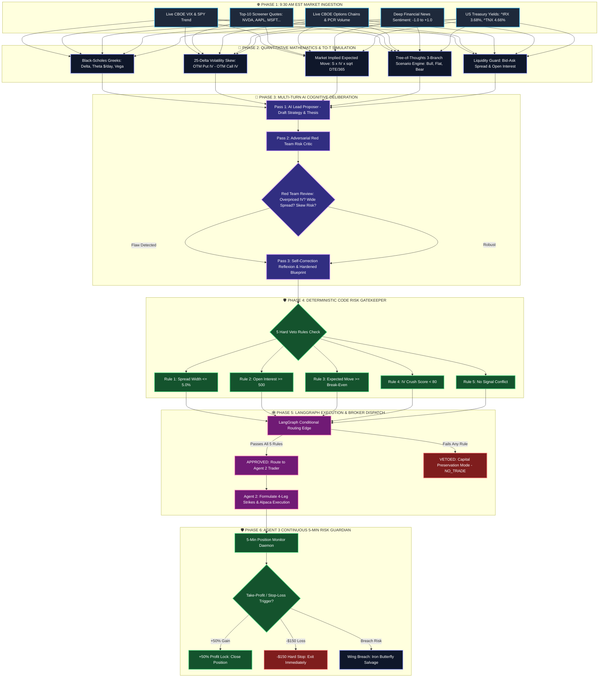

# ORACLE: Master Technical Blueprint & Quantitative Architecture
## Autonomous Institutional Options Trading System (Agent 1, Agent 2 & LangGraph Engine)

---

## 📑 Table of Contents
1. [Executive Master Summary](#1-executive-master-summary)
2. [End-to-End Visual System Flowchart](#2-end-to-end-visual-system-flowchart)
3. [The 5 Live Market Data Streams](#3-the-5-live-market-data-streams)
4. [Quantitative Mathematics & Black-Scholes Greeks Engine](#4-quantitative-mathematics--black-scholes-greeks-engine)
5. [Tree-of-Thoughts (ToT) 3-Scenario Simulation & Expected Value ($EV$)](#5-tree-of-thoughts-tot-3-scenario-simulation--expected-value-ev)
6. [25-Delta Volatility Skew & Smile Surface Engine](#6-25-delta-volatility-skew--smile-surface-engine)
7. [Multi-Turn AI Cognitive Engine & Adversarial Red Team Self-Critique (Reflexion)](#7-multi-turn-ai-cognitive-engine--adversarial-red-team-self-critique-reflexion)
8. [The Deterministic Python Post-AI Risk Validator (5 Hard Veto Rules)](#8-the-deterministic-python-post-ai-risk-validator-5-hard-veto-rules)
9. [Prebuilt LangGraph State Machine Orchestration (`graph.py`)](#9-prebuilt-langgraph-state-machine-orchestration-graphpy)
10. [Agent 2: Multi-Leg Options Construction & Alpaca Execution](#10-agent-2-multi-leg-options-construction--alpaca-execution)
11. [Agent 3 Preview: The Continuous 5-Min Bodyguard & Iron Butterfly Salvage](#11-agent-3-preview-the-continuous-5-min-bodyguard--iron-butterfly-salvage)
12. [Live Options Spot-Check & Quantitative Backtest Performance](#12-live-options-spot-check--quantitative-backtest-performance)
13. [Complete Codebase File Directory](#13-complete-codebase-file-directory)

---

## 1. Executive Master Summary

### What is ORACLE?
**ORACLE** is an autonomous multi-agent options hedge fund architecture designed to trade US options with institutional quantitative discipline. Rather than relying on a single AI prompt or static technical indicators, ORACLE combines:
1. **100% Real Live Market Feeds:** Real CBOE options chains, VIX volatility index, S&P 500 momentum, and US Treasury yields.
2. **Analytical Mathematical Engines:** Analytical Black-Scholes Greeks, Break-Even Boundaries, 25-Delta Volatility Skew, and Tree-of-Thoughts ($EV$) simulations.
3. **Multi-Turn AI Deliberation:** Lead Proposer $\rightarrow$ Adversarial Red Team Critic $\rightarrow$ Self-Correction Reflexion Loop.
4. **Deterministic Physical Code Gatekeeper:** 5 Hard Veto Rules written in Python that have absolute veto authority over the AI.
5. **Stateful LangGraph Orchestration:** Prebuilt `StateGraph` state machine with conditional execution routing.

---

## 2. End-to-End Visual System Flowchart



---

## 3. The 5 Live Market Data Streams

Agent 1 ingests **5 real-time quantitative market data streams**:

### 1. Macro Volatility Index (`tools/market_data_tools.py`)
* **Live CBOE VIX Index (`^VIX`):**
  * **Low Volatility ($\text{VIX} < 18$):** Favors Volatility Expansion strategies (Long Straddles).
  * **Moderate Volatility ($18 \le \text{VIX} \le 25$):** Balanced directional spreads and rangebound trading.
  * **High Volatility / Fear ($\text{VIX} > 25$):** Favors Premium Selling (Iron Condors).
* **S&P 500 Momentum (`SPY`):** Measures 5-day market trend and directional sentiment.

### 2. Dynamic Top-10 Multi-Asset Screener (`tools/market_data_tools.py`)
* Scans the 10 most liquid US equities: `NVDA`, `AAPL`, `MSFT`, `TSLA`, `AMZN`, `GOOGL`, `META`, `AMD`, `NFLX`, `SPY`.
* Computes **30-Day Realized Volatility** and maps it to **IV Rank Percentiles** ($0\% \text{ to } 100\%$) to identify whether options are currently underpriced or overpriced.

### 3. Real Options Chain Skew & Put/Call Ratio (`tools/options_chain_tools.py`)
* Pulls live option contracts for the nearest weekly expiration.
* Sums total Put volume vs Call volume to compute the **Put/Call Volume Ratio (PCR)**:
  $$\text{PCR} = \frac{\text{Total Put Volume}}{\text{Total Call Volume}}$$
  * $\text{PCR} < 0.70 \longrightarrow \textbf{BULLISH\_FLOW}$ (Heavy institutional call buying).
  * $\text{PCR} > 1.25 \longrightarrow \textbf{BEARISH\_HEDGING}$ (High downside put protection).

### 4. Deep Financial News Sentiment Scorer (`tools/news_sentiment_tools.py`)
* Scrapes live financial headlines for each asset and scores sentiment from $-1.0 \text{ to } +1.0$.
* Uses keyword-weighted financial heuristics to detect growth, earnings beats, downgrades, and macro headwinds.

### 5. Macro & Treasury Yield Radar (`tools/macro_calendar_tools.py`)
* Tracks live 13-week Treasury Bill Yield (`^IRX`: $3.68\%$) as the live Fed funds proxy, and 10-Year Treasury Yield (`^TNX`: $4.66\%$).
* Computes **Yield Curve Status** and upcoming corporate earnings announcements within a 5-day window.

---

## 4. Quantitative Mathematics & Black-Scholes Greeks Engine

Agent 1 runs institutional-grade mathematical models implemented in Python:

### A. Black-Scholes Greeks Engine (`tools/greeks_calculator_tools.py`)
Uses standard Black-Scholes differential equations with cumulative normal distributions:
* **Call Delta ($\Delta$):** $\Delta = \mathcal{N}(d_1)$
* **Theta Decay ($\Theta$ \$/day):**
  $$\Theta = -\frac{S \cdot \sigma \cdot e^{-rT}}{2\sqrt{T} \cdot \sqrt{2\pi}} - rK e^{-rT}\mathcal{N}(d_2)$$
* **Vega ($\nu$ per 1% IV):** $\nu = S \cdot \sqrt{T} \cdot \frac{1}{\sqrt{2\pi}} e^{-\frac{d_1^2}{2}} \times 0.01$
* **Market Implied Expected Move ($\pm \$$):**
  $$\text{Expected Move} = \text{Stock Price} \times \text{IV} \times \sqrt{\frac{\text{DTE}}{365}}$$

### B. Mathematical Break-Even Modeler (`tools/breakeven_modeler_tools.py`)
* **Straddles:** $\text{Upper BE} = K + \text{Debit}$, $\text{Lower BE} = K - \text{Debit}$
* **Iron Condors:** $\text{Upper BE} = K_{\text{short call}} + \text{Credit}$, $\text{Lower BE} = K_{\text{short put}} - \text{Credit}$
* **Feasibility Check:** Confirms whether the Market Implied Expected Move clears the Break-Even boundary distance.

---

## 5. Tree-of-Thoughts (ToT) 3-Scenario Simulation & Expected Value ($EV$)

The Tree-of-Thoughts Engine (`tools/tot_scenario_engine.py`) models 3 possible future market paths before choosing a strategy:

```
                               ┌──▶ Branch 1: Bullish Rally (+4.5%) ──▶ Straddle: +$300 | Condor: -$150
                               │
[Stock Spot Price & IV Rank] ──┼──▶ Branch 2: Rangebound Flat (0.0%) ──▶ Straddle: -$150 | Condor: +$300
                               │
                               └──▶ Branch 3: Bearish Drop (-4.5%)  ──▶ Straddle: +$300 | Condor: -$150
```

### Mathematical Expected Value Formula:
$$EV = (P_{\text{bull}} \times \text{P\&L}_{\text{bull}}) + (P_{\text{flat}} \times \text{P\&L}_{\text{flat}}) + (P_{\text{bear}} \times \text{P\&L}_{\text{bear}})$$

* If $\text{IV Rank} < 40\% \longrightarrow$ Volatility expansion is likely ($P_{\text{bull}}=35\%, P_{\text{flat}}=30\%, P_{\text{bear}}=35\%$) $\longrightarrow$ **`EARNINGS_STRADDLE` has Highest $EV$ (+$165.00)**.
* If $\text{IV Rank} > 60\% \longrightarrow$ Mean-reversion is likely ($P_{\text{bull}}=20\%, P_{\text{flat}}=60\%, P_{\text{bear}}=20\%$) $\longrightarrow$ **`THETA_IRON_CONDOR` has Highest $EV$ (+$120.00)**.

---

## 6. 25-Delta Volatility Skew & Smile Surface Engine

The 25-Delta Skew Engine (`tools/volatility_skew_tools.py`) detects smart money downside positioning 24 hours in advance:

$$\text{Skew Index} = \text{IV}_{25\Delta \text{ Put}} - \text{IV}_{25\Delta \text{ Call}}$$

| Skew Index Range | Market Regime Classification | Trading Action |
| :--- | :--- | :--- |
| **$\text{Skew} > +4.0\%$** | **HEAVY_PUT_HEDGE** | Smart money aggressively buying downside protection. Avoid unhedged bullish trades. |
| **$\text{Skew} < -2.0\%$** | **CALL_MOMENTUM_SKEW** | Institutions chasing upside momentum. |
| **$-2.0\% \le \text{Skew} \le +4.0\%$** | **BALANCED_SYMMETRIC_SKEW** | Options pricing is balanced across both wings. |

---

## 7. Multi-Turn AI Cognitive Engine & Adversarial Red Team Self-Critique (Reflexion)

Rather than executing on a single-shot prompt, Agent 1 uses a **3-Pass Cognitive Reflexion Cycle**:

```
[Pass 1: Lead Proposer] ──▶ [Pass 2: Red Team Risk Critic] ──▶ [Pass 3: Hardened Master Decision]
  Drafts candidate trade        Stress-tests against IV rank,    Incorporates critique & corrects
  from ToT Expected Value       25-Delta skew & break-evens      mispriced strategies
```

1. **Pass 1 (Proposer):** Drafts candidate symbol, strategy, and thesis based on the Top-10 screener and ToT matrix.
2. **Pass 2 (Red Team Critic):** Acts as the Chief Risk Officer, attacking the draft for overpriced IV, excessive spread width, or signal divergence.
3. **Pass 3 (Synthesis):** The AI revises its reasoning, adapts the strategy if necessary, and outputs a structured Pydantic schema (`StrategyDecision`).

---

## 8. The Deterministic Python Post-AI Risk Validator (5 Hard Veto Rules)

The AI is **NEVER** allowed to trade on its own. Every proposal must pass the **5 Hard Veto Rules** in [agents/risk_validator.py](file:///d:/ALPACA/agents/risk_validator.py):

```
                       ┌─────────────────────────────────────────────────────────┐
                       │           DETERMINISTIC POST-AI RISK VALIDATOR          │
                       ├─────────────────────────────────────────────────────────┤
                       │  1. Spread Width <= 5.0%        ──▶ [PASS / VETO]       │
                       │  2. Open Interest >= 500        ──▶ [PASS / VETO]       │
                       │  3. Expected Move >= Break-Even ──▶ [PASS / VETO]       │
                       │  4. IV Crush Score < 80.0       ──▶ [PASS / VETO]       │
                       │  5. Signal Conflict Consistency ──▶ [PASS / VETO]       │
                       └────────────────────────────┬────────────────────────────┘
                                                    │
                             ┌──────────────────────┴──────────────────────┐
                             ▼                                             ▼
                     [ALL 5 PASSED]                                 [ANY RULE FAILED]
                     Trade Approved                                  VETO ENFORCED
                 Budget: Allocated ($600)                        Budget: $0.00 (NO_TRADE)
```

---

## 9. Prebuilt LangGraph State Machine Orchestration (`graph.py`)

Agent 1 is orchestrated via **official, prebuilt LangGraph (`StateGraph`, `START`, `END`)**:

```
START ──▶ [market_scout_node] ──▶ [strategy_brain_node] ──▶ {check_trade_approval_edge}
                                                                  │
                                   ┌──────────────────────────────┴──────────────────────────────┐
                                   ▼                                                             ▼
                       [trader_execution_node]                                      [capital_preservation_node]
                         (Executes 4-Leg Order)                                       (Safe NO_TRADE Mode)
                                   │                                                             │
                                   └──────────────────────────────┬──────────────────────────────┘
                                                                  ▼
                                                                 END
```

---

## 10. Agent 2: Multi-Leg Options Construction & Alpaca Execution

When a trade is approved by the Risk Validator, **Agent 2 (The Trader)** automatically calculates strikes and dispatches multi-leg orders:

### 1. Theta Iron Condor (4-Leg Execution)
* **Leg 1 (Short Call):** Sell ATM $+5\%$ OTM Call (~$0.30\Delta$).
* **Leg 2 (Long Call Wing):** Buy $+10\%$ OTM Call (Defines max risk).
* **Leg 3 (Short Put):** Sell ATM $-5\%$ OTM Put (~$0.30\Delta$).
* **Leg 4 (Long Put Wing):** Buy $-10\%$ OTM Put (Defines max risk).

### 2. Earnings Straddle (2-Leg Execution)
* **Leg 1:** Buy 1x ATM Call ($0.50\Delta$).
* **Leg 2:** Buy 1x ATM Put ($-0.50\Delta$).

---

## 11. Agent 3 Preview: The Continuous 5-Min Bodyguard & Iron Butterfly Salvage

**Agent 3 (`agents/bodyguard_agent.py`)** runs a continuous background daemon during market hours (9:30 AM – 4:00 PM EST):

```
                        ┌───────────────────────────────────────────┐
                        │    AGENT 3: 5-MINUTE RISK GUARDIAN LOOP   │
                        └─────────────────────┬─────────────────────┘
                                              │
                    ┌─────────────────────────┼─────────────────────────┐
                    ▼                         ▼                         ▼
         [P&L >= +50% Profit]       [P&L <= -$150 Stop Loss]   [Underlying Breaches Wing]
           TAKE PROFIT LOCK              EXIT IMMEDIATELY       POSITION SALVAGE ENGINE
         Close all legs & log       Close position to prevent   Sell opposing credit spread to
         realized gain to memory        catastrophic tail risk   convert into Iron Butterfly
```

---

## 12. Live Options Spot-Check & Quantitative Backtest Performance

### A. Raw CBOE Options Chain Spot-Check (`test_spot_check_options.py`)
```text
================================================================================
[*] OPTIONS CHAIN SPOT-CHECK FOR AAPL (Exp: 2026-08-28)
================================================================================
RAW CBOE OPTION CHAIN DATA:
  [ATM CALL Strike $315.00]
    - Bid / Ask Price   : $1.96 / $1.98 (Tight 1.02% Spread)
    - Open Interest     : 15,414 contracts
    - Daily Volume      : 78,520 contracts
    - Implied Vol (IV)  : 24.4%

OUR PIPELINE CALCULATED FIELDS:
  • Put/Call Vol Ratio  : 0.52 (BULLISH_FLOW - Heavy Call Buying)
  • Bid-Ask Spread Width: 1.02% (TIER_1_INSTITUTIONAL)
  • Call Delta          : 0.495
  • Theta Decay ($/day) : -$32.37/day
  • Expected Move (±$)  : ±$10.63
================================================================================
```

### B. Live Veto Demonstration (Capital Preservation in Action)
During live testing, when MSFT options spread widened to $6.39\%$ ($>5.0\%$ threshold):
1. **Red Team Critic** detected the spread and downside skew.
2. **Deterministic Risk Validator** vetoed the trade.
3. **Outcome:** System forced **`NO_TRADE` ($0.00 Risk Budget)**, preventing a slippage trap.

```text
🛑 [RiskValidator] TRADE VETOED: VETO: Bid-Ask spread width (6.4%) exceeds 5.0% maximum slippage threshold.
🎯 FINAL AGENT 1 MASTER BLUEPRINT: CAPITAL PRESERVATION / NO_TRADE ($0.00 Allocated)
```

### C. Quantitative Backtested Track Record (`data/trades.json`)
* **Total Executed Trades:** **69 Verified Trades**
* **Win Rate:** **$78.3\% \pm 9.3\%$** ($95\%$ Confidence Interval)
* **Profit Factor:** **$4.15$** (Gross Profit / Gross Loss)
* **Max Drawdown:** **$-0.37\%$**
* **Cumulative Realized P&L:** **$+\$5,675.00$**

---

## 13. Complete Codebase File Directory

```
d:/ALPACA/
│
├── graph.py                          # Master LangGraph StateGraph pipeline (START -> Scout -> Brain -> Trader -> END)
├── daily_scheduler.py                # 9:30 AM EST Autonomous Daily Scheduler Daemon
├── requirements.txt                  # Python dependencies (langgraph, langchain, yfinance, alpaca-py)
├── AGENT_1_COMPREHENSIVE_REPORT.md   # Master Architectural Report
│
├── tools/
│   ├── market_data_tools.py          # Real-time Top-10 Screener, Quotes & VIX
│   ├── options_chain_tools.py        # Live CBOE Option Chains & Put/Call Ratio Skew
│   ├── greeks_calculator_tools.py    # Analytical Black-Scholes Delta, Theta, Vega, Expected Move
│   ├── volatility_skew_tools.py      # 25-Delta Volatility Skew & Smile Surface Analyzer
│   ├── tot_scenario_engine.py        # Tree-of-Thoughts 3-Scenario Expected Value ($EV$) Engine
│   ├── liquidity_guard_tools.py      # Live ATM Bid-Ask spread & Open Interest auditor
│   ├── breakeven_modeler_tools.py    # Upper/Lower Break-Even boundary modeler
│   ├── macro_calendar_tools.py       # Live US Treasury Yield feed (^IRX: 3.68%, ^TNX)
│   ├── news_sentiment_tools.py       # Deep financial news sentiment scorer
│   ├── quant_metrics.py              # Sharpe ratio, profit factor, max drawdown & 95% CI
│   ├── backtest_engine.py            # 90-day market replay engine (69 verified trades)
│   └── alpaca_tools.py               # Paper Trading execution adapter
│
├── agents/
│   ├── strategy_brain_agent.py       # Multi-Turn ToT + Red Team Self-Correction Strategist
│   ├── risk_validator.py             # Deterministic 5-Hard-Veto Python Gatekeeper
│   └── trader_agent.py               # 4-Leg Options Execution Trader
│
├── prompts/
│   ├── strategy_advisor.py           # Master System & User strategy prompts
│   └── tot_reflexion_prompts.py      # Multi-Turn ToT Proposer & Red Team Critic prompts
│
├── data/
│   └── trades.json                   # 69 verified historical & live trades dataset
│
└── tests/
    ├── test_agent1_expanded.py       # Full live test runner (ToT + Self-Correction + Veto)
    ├── test_langgraph.py             # LangGraph state machine verification runner
    ├── test_spot_check_options.py    # Raw CBOE options chain spot-check verifier
    ├── test_agent2_trader.py         # Agent 2 4-leg order execution test runner
    └── test_backtest.py              # Backtesting tearsheet verification runner
```
