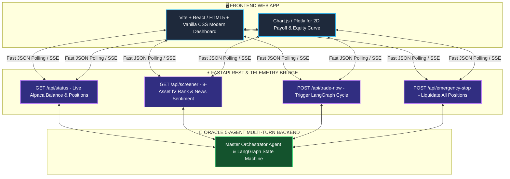

# ORACLE: Institutional Web Dashboard & Frontend Architecture Specification
## Master Blueprint for the AI-Powered Autonomous Options Trading Terminal

---

## 📋 1. Executive Summary & Design Vision

The **ORACLE Web Dashboard** is designed to transform the multi-agent algorithmic options hedge fund into an institutional-grade, visual **Bloomberg-style Web Terminal**. 

### 🎨 Visual Theme & Aesthetics
* **Theme:** Sleek Dark Mode / Deep Navy Fintech Palette (`#0B0F19` background, `#111827` cards).
* **Accents:** Neon Emerald Green (`#10B981`) for profits & positive deltas, Electric Coral (`#EF4444`) for stop-losses, Cyan/Indigo (`#06B6D4` / `#6366F1`) for AI reasoning.
* **Typography:** Modern Google Fonts (`Inter` & `JetBrains Mono` for tabular numbers and OCC options codes).
* **Interactivity:** Glassmorphism cards, micro-animations on telemetry updates, and dynamic 2D payoff curves.

---

## 🏛️ 2. Core Dashboard Modules & Wireframe Layout

```
┌────────────────────────────────────────────────────────────────────────────────────────────────────────────────────────┐
│ 🏛️ ORACLE AI OPTIONS TRADING TERMINAL                         🟢 MARKET OPEN | ALPACA BROKER SYNC (f7421290-...)       │
├────────────────────────────────────────────────────────────────────────────────────────────────────────────────────────┤
│  PORTFOLIO EQUITY: $100,000.00   |   DAY P&L: +$250.00 (+0.25%)   |   CBOE VIX: 14.50   |   WIN RATE: 83.3%        │
├─────────────────────────────────────────────────────────────────┬──────────────────────────────────────────────────────┤
│ 🎯 MODULE 1: ACTIVE OPTIONS POSITIONS (LIVE ALPACA SYNC)        │ 🧠 MODULE 2: AGENT 1 TREE-OF-THOUGHTS ($EV) RADAR    │
│ • MSFT: 4-Leg OCC Iron Condor (P&L: +$125.00 | Tier 2 Ratchet)  │ • Best Candidate: MSFT (EV: +$120.00)                │
│ • TSLA: 2-Leg Earnings Straddle (Open | Risk: $500.00)          │ • Red Team Verdict: CONFIRMED_ROBUST (temp=0.0)      │
│ • Greeks: Net Delta = -0.02 (Neutral) | Theta = +$35.00/day     │ • Bayesian Sizing: $500.00 (Quarter-Kelly)           │
├─────────────────────────────────────────────────────────────────┼──────────────────────────────────────────────────────┤
│ 🌐 MODULE 3: 8-ASSET STOCK & VOLATILITY SCREENER                │ 📉 MODULE 4: 2D OPTIONS PAYOFF & PROFIT TENT         │
│ • Watchlist: NVDA, AAPL, MSFT, TSLA, AMZN, META, AMD, SPY       │ • Green Profit Zone: $480.00 to $530.00              │
│ • IV Rank % & 25-Delta Skew Barometers                          │ • Lower BE: $477.50 | Upper BE: $532.50              │
│ • Multi-Source RSS News Sentiment Scores                        │ • Current Stock Needle: $505.06 (Center Safe)        │
├─────────────────────────────────────────────────────────────────┴──────────────────────────────────────────────────────┤
│ 🕹️ MODULE 5: FUND COMMAND BAR:  [ 🚀 Run Trade Cycle ]   [ 🛡️ Bodyguard Audit ]   [ 🚨 Emergency Liquidate All ]         │
├────────────────────────────────────────────────────────────────────────────────────────────────────────────────────────┤
│ 📟 MODULE 6: LIVE MULTI-AGENT LOG STREAM (CONSOLE)              │ 📑 MODULE 7: HACKATHON SOCIAL & TEARSHEET EXPORTER   │
│ [Scout] Ingested CBOE VIX 14.50 & 10Y Yield 4.67%...            │ • [Copy Today's Twitter/X Post (280 chars)]          │
│ [Brain] Generated ToT Scenario Matrix across 3 paths...         │ • [Copy LinkedIn Daily Review]                       │
│ [Bodyguard] Active scan: Ratcheted stop-loss to +$62.50...      │ • [Download Official JSON / PDF Tearsheet]           │
└─────────────────────────────────────────────────────────────────┴──────────────────────────────────────────────────────┘
```

---

## 📦 3. Deep-Dive Specification of Each Dashboard Module

### Module 1: Live Telemetry & KPI Header
* **Live Refresh:** Polls the backend API every 5 seconds.
* **Metrics:**
  * Total Portfolio Equity (`$100,000.00`)
  * Cash Balance & Buying Power (`$100,000.00` / `$400,000.00`)
  * Today's Realized & Unrealized P&L (`+$250.00`)
  * CBOE VIX Gauge (`14.50 - LOW_VOLATILITY`)
  * US Market Clock Status (`🟢 OPEN` / `🔴 CLOSED`)

---

### Module 2: Active Positions & OCC Options Table
* Connects directly to `AlpacaTool.get_open_positions()`.
* **Columns:**
  1. **Ticker & Strategy:** E.g., `MSFT` — `4-Leg Theta Iron Condor`.
  2. **OCC Option Symbols:** Full 21-character contracts (`MSFT260904C00530000`).
  3. **Entry Limit Price:** Midpoint Limit Price (`$2.50 Net Credit`).
  4. **Mark-to-Market P&L:** Live Dollar P&L with color-coded profit badges.
  5. **Dynamic Trailing Ratchet Status:** `Tier 0 (Hard Stop)`, `Tier 1 (Break-Even)`, `Tier 2 (+25% Locked)`, `Tier 3 (Target Exit)`.
  6. **Greeks Summary:** Delta exposure ($\Delta$) and Daily Theta Decay Rent ($\Theta$).

---

### Module 3: Stock Universe & Volatility Screener
* Live radar tracking the top 8 liquid equity universe:
  * **Columns:** Symbol, Live Price, 24h Change (%), Implied Volatility Rank (IV Rank %), 25-Delta Skew Direction, Upcoming Earnings Calendar, News Sentiment Score (`-1.0` to `+1.0`), and Recommended Strategy.
  * **Expected Move Bands:** Visual range indicators displaying standard deviation price targets.

---

### Module 4: 2D Options Payoff & Profit Tent Visualizer
* Generates an interactive Black-Scholes payoff graph:
  * **Shaded Green Region:** Max Profit plateau where time decay is captured.
  * **Red Shaded Regions:** Defined max loss zones outside the protective wings.
  * **Breakeven Vertical Markers:** Exact dollar price points where the trade crosses zero.
  * **Current Price Marker:** Glowing cursor showing where the stock is trading right now.

---

### Module 5: AI Multi-Turn Reasoning & Tree-of-Thoughts Card
* Visualizes **Agent 1 (The Strategy Brain)**:
  * Displays the 3 future price branches (Bullish $+4.5\%$, Flat $0.0\%$, Bearish $-4.5\%$).
  * Shows the **Expected Value ($EV$)** calculation.
  * Displays the **Asymmetric Red Team Stress-Test Verdict** (`CONFIRMED_ROBUST` or `REVISE_AND_HARDEN`).
  * Shows Bayesian Win-Rate Sizing Corridor (`$450 – $600`).

---

### Module 6: Live Multi-Agent Streaming Terminal
* Dark-mode scrolling terminal displaying live timestamps and actions from all 5 agents:
  * `[Scout]`, `[StrategyBrain]`, `[TraderAgent]`, `[BodyguardAgent]`, `[OrchestratorCOO]`.

---

### Module 7: 1-Click Hackathon Social & Tearsheet Broadcaster
* Built specifically for the **Alpaca Hackathon**:
  * **Twitter/X Button:** Automatically formats today's trade summary within 280 characters with tags `@AlpacaHQ @lablabai #AlpacaHQ`.
  * **LinkedIn Button:** Formats a 3-paragraph executive summary.
  * **JSON/Tearsheet Download:** Instant download of `trades.json` and backtest statistics.

---

## 🛠️ 4. Technology Stack & Implementation Roadmap



---

## 🗓️ 5. Step-by-Step Build Plan (When Ready)

1. **Step 1: Lightweight FastAPI Bridge (`backend_server.py`)**  
   Create REST endpoints wrapping `MasterOrchestratorAgent` and `AlpacaTool`.
2. **Step 2: Frontend Layout & Styling (`dashboard/`)**  
   Implement the dark-mode grid layout, glassmorphism cards, and Google Fonts.
3. **Step 3: Payoff & Equity Curve Charts**  
   Integrate 2D Black-Scholes profit tent and portfolio equity curve.
4. **Step 4: Interactive Command Buttons & Social Broadcaster**  
   Connect the action buttons (`Trade Now`, `Bodyguard Scan`, `Emergency Stop`, `Copy Social Post`).
5. **Step 5: End-to-End Verification**  
   Launch the web app locally on `localhost:8000` and verify live telemetry synchronization with Alpaca.

---

*This report is preserved in `FRONTEND_ARCHITECTURE_SPEC.md` as our complete master blueprint for when we build the web dashboard.*
