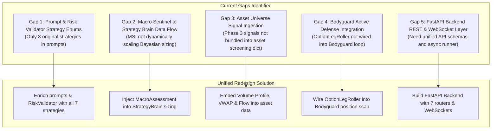

# ORACLE Multi-Agent System - Gap Analysis & Redesign Blueprint

This document presents a comprehensive audit of the entire ORACLE codebase ([agents/](file:///d:/ALPACA/agents), [tools/](file:///d:/ALPACA/tools), [strategies/](file:///d:/ALPACA/strategies), [prompts/](file:///d:/ALPACA/prompts), and [graph.py](file:///d:/ALPACA/graph.py)), identifying architectural gaps, data flow bottlenecks, and the unified redesign required before implementing the FastAPI backend.

---

## 1. Executive Summary of Identified Gaps

---

## 2. Deep Dive: 5 Critical Gaps & Solutions

### Gap 1: Prompt & Risk Validator Strategy Alignment
* **Current State**: [prompts/strategy_advisor.py](file:///d:/ALPACA/prompts/strategy_advisor.py) and [prompts/tot_reflexion_prompts.py](file:///d:/ALPACA/prompts/tot_reflexion_prompts.py) only instruct the LLM on 3 legacy strategies (`EARNINGS_STRADDLE`, `THETA_IRON_CONDOR`, `DIRECTIONAL_SPREAD`). The 4 new institutional strategies are not in the prompt enums.
* **Redesign Fix**: Update prompts and [agents/risk_validator.py](file:///d:/ALPACA/agents/risk_validator.py) to include all 7 strategies with their specific mathematical safety checks (e.g. Broken Wing Butterfly broken-gap limits, 0DTE delta constraints, Calendar spread term-structure checks).

---

### Gap 2: Macro Sentinel to Strategy Brain State Coupling
* **Current State**: [MacroIntelligenceAgent](file:///d:/ALPACA/agents/macro_intelligence_agent.py) calculates the Macro Shock Index (MSI) and regime (`EVENT_BLACKOUT`, `HIGH_MACRO_VOLATILITY`, `RISK_ON_EXPANSION`), but [StrategyBrainAgent](file:///d:/ALPACA/agents/strategy_brain_agent.py) was not accepting `macro_assessment` to scale its Bayesian Kelly position sizing dynamically.
* **Redesign Fix**: Pass `macro_assessment` into `StrategyBrainAgent.analyze_and_decide()`. Apply `max_allocation_multiplier` directly to Bayesian Kelly sizing ($0.25\times$ to $1.0\times$).

---

### Gap 3: Data Signal Enrichment in Asset Universe Screening
* **Current State**: The Phase 3 tools ([technical_volume_tools.py](file:///d:/ALPACA/tools/technical_volume_tools.py), [alternative_sentiment_tools.py](file:///d:/ALPACA/tools/alternative_sentiment_tools.py), [unusual_flow_tools.py](file:///d:/ALPACA/tools/unusual_flow_tools.py)) are functional standalone, but were not bundled into the asset dictionary in [tools/market_data_tools.py](file:///d:/ALPACA/tools/market_data_tools.py).
* **Redesign Fix**: Ingest Volume Profile (POC/VAH/VAL), Anchored VWAP ±1SD/±2SD, Social Polarity, SEC Form 4 Insiders, and Unusual Flow into `get_asset_universe_data()`.

---

### Gap 4: Bodyguard Active Position Defense Wiring
* **Current State**: [BodyguardAgent](file:///d:/ALPACA/agents/bodyguard_agent.py) enforces profit ratchet locks (+50% take profit, -$150 stop loss), but did not invoke [OptionLegRoller](file:///d:/ALPACA/tools/leg_roller_tools.py) when an Iron Condor or Credit Spread wing is threatened.
* **Redesign Fix**: Wire `OptionLegRoller.calculate_wing_roll()` directly into the Bodyguard scan when price approaches within $2\%$ of a short wing.

---

### Gap 5: FastAPI Backend Architecture Alignment
* **Current State**: The backend specification is drafted in [BACKEND_ARCHITECTURE_SPEC.md](file:///d:/ALPACA/BACKEND_ARCHITECTURE_SPEC.md), but the server modules (`backend/`) have not yet been coded.
* **Redesign Fix**: Implement the 7 modular API routers, Pydantic schemas, WebSocket broadcast manager, and non-blocking asynchronous pipeline runner.

---

## 3. Redesign Action Checklist

1. [ ] **Prompt & Validator Upgrade**: Update `prompts/strategy_advisor.py`, `prompts/tot_reflexion_prompts.py`, and `agents/risk_validator.py` with all 7 strategies.
2. [ ] **Macro Coupling**: Update `agents/strategy_brain_agent.py` and `graph.py` to pass `macro_assessment` and dynamically scale Kelly sizing.
3. [ ] **Signal Ingestion**: Enrich `tools/market_data_tools.py` with Volume Profile, Anchored VWAP, Insider Sentiment, and Unusual Flow.
4. [ ] **Bodyguard Roller**: Connect `OptionLegRoller` into `agents/bodyguard_agent.py`.
5. [ ] **FastAPI Backend Build**: Implement `backend/` directory with all schemas, services, routers, and WebSockets.
6. [ ] **End-to-End Test & Verification**: Run full test suites (`test_expanded_agents.py`, `test_expanded_strategies.py`, `test_expanded_infrastructure.py`, `test_backend_api.py`).
