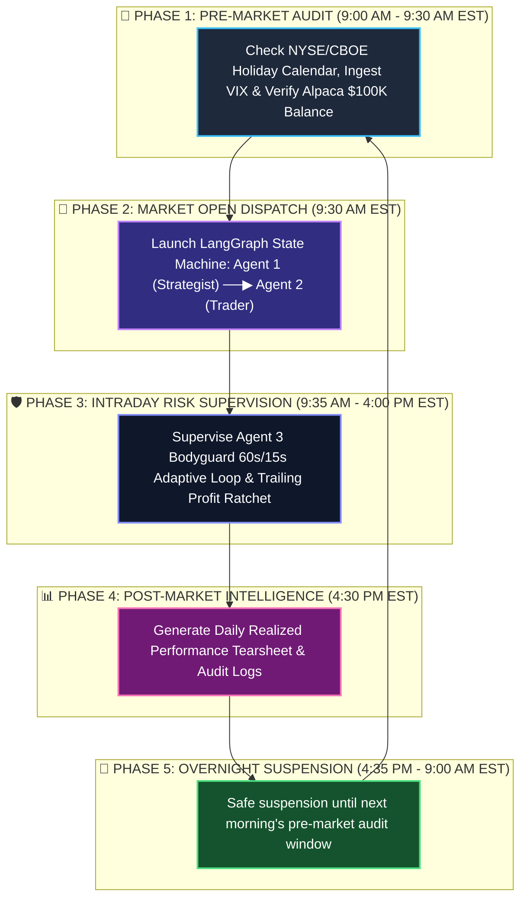
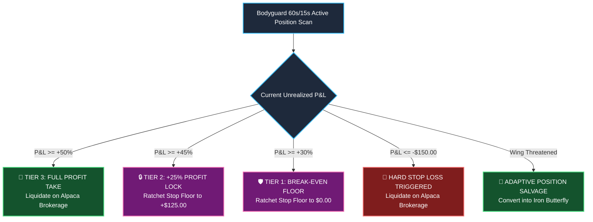

# 🏛️ ORACLE: Autonomous Multi-Agent AI Options Trading Hedge Fund

[](https://alpaca.markets)
[](https://langchain.com)
[](https://python.org)
[](LICENSE)

> **ORACLE** is an institutional-grade, fully autonomous algorithmic options trading fund built for the **Alpaca AI Trading Agents Hackathon**. Powered by a coordinated **4-Agent + 24-Sub-Agent StateGraph Architecture**, ORACLE combines **Tree-of-Thoughts (ToT) Expected Value ($EV$) modeling**, **Asymmetric Red Team self-critique (`temp=0.0`)**, **CBOE Strike Grid Snapping**, **OCC 21-character option symbol routing**, **Midpoint Limit Pricing**, and a **60s/15s Adaptive Risk Bodyguard** to trade options on Alpaca Paper Brokerage.

---

## 📑 Table of Contents
- [Executive Overview](#-executive-overview)
- [System Architecture (4 Agents & 24 Sub-Agents)](#-system-architecture-4-primary-agents--24-sub-agents)
- [How Each Agent Works (Step-by-Step)](#-how-each-agent-works-step-by-step)
- [24-Hour Autonomous Daily Lifecycle](#-24-hour-autonomous-daily-lifecycle)
- [Dynamic Trailing Profit Ratchet & Circuit Breakers](#-dynamic-trailing-profit-ratchet--circuit-breakers)
- [The 4 Quantitative Options Strategies](#-the-4-quantitative-options-strategies)
- [Repository File Structure](#-repository-file-structure)
- [Institutional 2-File Architecture](#-institutional-2-file-architecture)
- [Interactive Command Center & CLI](#-interactive-command-center--cli)
- [Installation & Quickstart](#-installation--quickstart)
- [Verification Test Suite](#-verification-test-suite)
- [Hackathon Compliance & Proof](#-hackathon-compliance--proof)

---

## 📋 Executive Overview

Traditional algorithmic trading bots rely on rigid if/else rules that fail when market regimes shift. **ORACLE** operates as an autonomous quantitative firm with specialized roles:

* **Tree-of-Thoughts ($EV$) Decision Brain:** Simulates 3 parallel future market scenarios ($+4.5\%$, $0.0\%$, $-4.5\%$) and computes probability-weighted Expected Values before allocating risk.
* **Asymmetric Red Team Stress-Testing:** Subjecting every trade proposal to an adversarial self-critique pass at `temperature=0.0` to identify hidden tail-risks and liquidity traps.
* **Deterministic Code Gatekeeper:** Enforces 4 hard mathematical veto rules (Liquidity depth $\ge 500$, Bid/Ask Spread $\le 5\%$, IV Crush Risk $<80$, Break-Even clearance).
* **Bayesian Position Sizing:** Automatically shrinks win rates toward the 55% baseline ($M=15$) to keep trade risk strictly bounded within the **`$450 – $600`** safety corridor.
* **OCC Standard Options Execution:** Formats official 21-character OCC option symbols (`MSFT260904C00530000`) and pegs limit orders to the natural midpoint ($\frac{\text{Bid}+\text{Ask}}{2}$), saving $\$15–\$50$ per trade in slippage.
* **60s/15s Adaptive Active Risk Bodyguard:** Synchronizes live broker P&L directly from Alpaca, enforces trailing profit ratchets ($+30\% \rightarrow \text{Break-Even}, +45\% \rightarrow +25\%\text{ Lock}, +50\% \rightarrow \text{Exit}$), auto-closes expiring 0-DTE options on Friday at 3:30 PM EST, and converts breached Iron Condors into **Delta-Neutral Iron Butterflies**.

---

## 🏛️ System Architecture: 4 Primary Agents & 24 Sub-Agents

```text
                                  👑 MASTER ORCHESTRATOR AGENT (FUND COO)
                                             │
      ┌──────────────────────────────┬───────┴──────────────────────┬──────────────────────────────┐
      │                              │                              │                              │
      ▼                              ▼                              ▼                              ▼
🧠 AGENT 1: STRATEGY BRAIN      ⚡ AGENT 2: EXECUTION TRADER   🛡️ AGENT 3: THE BODYGUARD      👑 ORCHESTRATION ENGINES
  ├─ 1.1 Market Scout Node       ├─ 2.1 CBOE Strike Snapper     ├─ 3.1 Live Broker Sync        ├─ 4.1 Pre-Market Diagnostics
  ├─ 1.2 Tree-of-Thoughts (EV)   ├─ 2.2 OCC Symbol Generator    ├─ 3.2 Profit Ratchet Engine   ├─ 4.2 LangGraph State Machine
  ├─ 1.3 Red Team Critic         ├─ 2.3 Midpoint Price Engine   ├─ 3.3 VIX Circuit Breaker     ├─ 4.3 Intraday Supervisor
  ├─ 1.4 5-Tier Gatekeeper       ├─ 2.4 Margin Validator        ├─ 3.4 0-DTE Gamma Guard       ├─ 4.4 Post-Market Tearsheet
  ├─ 1.5 Bayesian Sizer          ├─ 2.5 Multi-Leg Router        ├─ 3.5 Butterfly Salvage       └─ 4.5 Command Center CLI
  ├─ 1.6 News Sentiment                                         └─ 3.6 Adaptive Speed Guard
  ├─ 1.7 Volatility Skew
  └─ 1.8 Runner-Up Fallback
```

### 🔄 Multi-Agent Interactive Pipeline Flowchart:

```mermaid
flowchart TD
    %% Styling
    classDef coo fill:#1E293B,stroke:#38BDF8,stroke-width:2px,color:#FFFFFF;
    classDef brain fill:#312E81,stroke:#C084FC,stroke-width:2px,color:#FFFFFF;
    classDef trader fill:#0F172A,stroke:#818CF8,stroke-width:2px,color:#FFFFFF;
    classDef guard fill:#701A75,stroke:#F472B6,stroke-width:2px,color:#FFFFFF;
    classDef broker fill:#14532D,stroke:#4ADE80,stroke-width:2px,color:#FFFFFF;

    subgraph ORCHESTRATION_LAYER ["👑 TIER 1: MASTER ORCHESTRATOR AGENT (FUND COO)"]
        COO["Master Orchestrator Agent (agents/orchestrator_agent.py)"]:::coo
        LG["Compiled LangGraph StateGraph Machine (graph.py)"]:::coo
        CMD["Interactive Fund Command Center (main.py)"]:::coo
    end

    subgraph STRATEGY_LAYER ["🧠 TIER 2: AGENT 1 (THE STRATEGY BRAIN)"]
        A1["Strategy Brain Agent (agents/strategy_brain_agent.py)"]:::brain
        S1["1.1 Market Scout Node"]:::brain
        S2["1.2 Tree-of-Thoughts EV Modeler"]:::brain
        S3["1.3 Red Team Risk Critic (temp=0.0)"]:::brain
        S4["1.4 5-Tier Risk Gatekeeper"]:::brain
        S5["1.5 Bayesian Kelly Sizer"]:::brain
        S6["1.6 News Sentiment Scorer"]:::brain
        S7["1.7 25-Delta Volatility Skew"]:::brain
        S8["1.8 Runner-Up Fallback Engine"]:::brain
    end

    subgraph EXECUTION_LAYER ["⚡ TIER 3: AGENT 2 (THE EXECUTION TRADER)"]
        A2["Execution Trader Agent (agents/trader_agent.py)"]:::trader
        T1["2.1 CBOE Strike Grid Snapper"]:::trader
        T2["2.2 OCC 21-Char Symbol Generator"]:::trader
        T3["2.3 Smart Midpoint Pricing Engine"]:::trader
        T4["2.4 Pre-Flight Margin Validator"]:::trader
        T5["2.5 Multi-Leg Atomic Package Router"]:::trader
    end

    subgraph RISK_LAYER ["🛡️ TIER 4: AGENT 3 (THE ACTIVE BODYGUARD)"]
        A3["The Bodyguard Agent (agents/bodyguard_agent.py)"]:::guard
        G1["3.1 Live Alpaca Position Sync"]:::guard
        G2["3.2 Dynamic Trailing Profit Ratchet"]:::guard
        G3["3.3 Black Swan VIX Circuit Breaker"]:::guard
        G4["3.4 Friday 0-DTE Assignment Guard"]:::guard
        G5["3.5 Iron Butterfly Position Salvage"]:::guard
        G6["3.6 60s/15s Adaptive Speed Controller"]:::guard
    end

    subgraph BROKERAGE ["🏛️ BROKERAGE & LEDGER"]
        ALP["Alpaca Paper Brokerage API (Account: f7421290-..., $100K Cash)"]:::broker
        LED["Clean Live Trade Ledger (data/trades.json)"]:::broker
        HIS["Archived Backtest Dataset (data/historical_backtest.json)"]:::broker
    end

    %% Flow connections
    CMD & COO --> LG
    LG --> S1 --> A1
    A1 --> S2 & S3 & S4 & S5 & S6 & S7 & S8
    A1 -->|"Validated Master Blueprint"| A2
    A2 --> T1 & T2 & T3 & T4 & T5
    A2 -->|"Dispatches OCC Complex Limit Orders"| ALP
    A2 -->|"Appends Executed Trade"| LED
    COO -->|"Supervises Intraday (9:35 AM - 4:00 PM)"| A3
    A3 --> G1 & G2 & G3 & G4 & G5 & G6
    A3 -->|"Syncs Live Broker P&L"| ALP
    A3 -->|"Executes Physical Exits / Salvage"| ALP
    A3 -->|"Updates Realized P&L"| LED
```



---

## 🧠 How Each Agent Works (Step-by-Step)

### 1. 🧠 Agent 1: The Strategy Brain (`agents/strategy_brain_agent.py`)
* **Step 1 (Market Scouting):** Sub-Agent 1.1 fetches live CBOE VIX, US Treasury yields (10Y/3M), and real-time options chain data for the 8-asset universe (`NVDA`, `AAPL`, `MSFT`, `TSLA`, `AMZN`, `META`, `AMD`, `SPY`).
* **Step 2 (Tree-of-Thoughts Evaluation):** Sub-Agent 1.2 models 3 parallel future branches ($+4.5\%, 0\%, -4.5\%$) and calculates the probability-weighted Expected Value ($EV$):
  $$EV = \sum_{i \in \{\text{Bull, Flat, Bear}\}} P_i \times \text{Payoff}_i$$
* **Step 3 (Adversarial Red Team Audit):** Sub-Agent 1.3 performs a zero-temperature (`temp=0.0`) stress-test audit on the proposal to identify hidden liquidity traps or excessive gamma exposure.
* **Step 4 (Deterministic Code Gatekeeper):** Sub-Agent 1.4 validates the trade against 4 hard rules:
  1. Bid/Ask spread $\le 5.0\%$
  2. Open interest $\ge 500$ contracts
  3. Break-even buffer $\ge \text{Expected Move}$
  4. IV Crush risk $< 80$
* **Step 5 (Bayesian Kelly Position Sizing):** Sub-Agent 1.5 shrinks the win rate with $M=15$ prior observations:
  $$\hat{p}_{\text{shrunk}} = \frac{W_{\text{actual}} + 15 \times 0.55}{N_{\text{actual}} + 15}$$
  Risk budget is strictly bounded to the **`$450 – $600`** safety corridor.
* **Step 6 (Runner-Up Fallback Engine):** If Candidate #1 fails, Sub-Agent 1.8 immediately evaluates the next highest-$EV$ candidate before declaring `NO_TRADE`.

---

### 2. ⚡ Agent 2: The Execution Trader (`agents/trader_agent.py`)
* **Step 1 (CBOE Strike Grid Snapping):** Sub-Agent 2.1 snaps calculated mathematical strikes to exact exchange increments ($1.00, $2.50, $5.00).
* **Step 2 (OCC Symbol Formatting):** Sub-Agent 2.2 formats official 21-character standard OCC option symbols:
  $$\text{OCC} = \text{ROOT} + \text{YYMMDD} + \text{TYPE} + \text{8-digit Strike}$$
  *(e.g., `MSFT260904C00530000` = MSFT 2026-09-04 $530.00 Call)*
* **Step 3 (Smart Midpoint Limit Pricing):** Sub-Agent 2.3 computes the net limit price at the natural midpoint:
  $$\text{Midpoint} = \frac{\text{Bid} + \text{Ask}}{2}$$
  Saving $\$15–\$50$ per trade in market-order slippage.
* **Step 4 (Pre-Flight Margin Validation):** Sub-Agent 2.4 calculates required spread collateral ($2,500) and confirms account margin.
* **Step 5 (Atomic Broker Order Packaging):** Sub-Agent 2.5 packages all legs into a single structured order and dispatches it directly to the **Alpaca REST API**.

---

### 3. 🛡️ Agent 3: The Bodyguard (`agents/bodyguard_agent.py`)
* **Step 1 (Live Alpaca Position Synchronization):** Sub-Agent 3.1 reads `client.get_all_positions()` from Alpaca every cycle to track exact broker-reported unrealized P&L.
* **Step 2 (Dynamic Trailing Profit Ratchet):** Sub-Agent 3.2 dynamically protects winning trades:
  * **P&L $\ge +30\%$:** Ratchet stop-loss from $-\$150 \longrightarrow \mathbf{\$0.00\text{ (Break-Even Floor)}}$.
  * **P&L $\ge +45\%$:** Ratchet stop-loss to $\mathbf{+\$125.00\text{ (+25\% Guaranteed Profit Lock)}}$.
  * **P&L $\ge +50\%$:** Trigger full profit take exit (`AlpacaTool.close_position`).
  * **P&L $\le -\$150$:** Trigger hard stop-loss exit (`AlpacaTool.close_position`).
* **Step 3 (Market Circuit Breaker):** Sub-Agent 3.3 detects intraday VIX spikes ($>+25\%$) or SPY drops ($<-3\%$) and activates emergency portfolio freeze.
* **Step 4 (Friday 0-DTE Early Assignment Guard):** Sub-Agent 3.4 automatically closes short option legs at **3:30 PM EST on Friday** to eliminate weekend stock assignment risk.
* **Step 5 (Adaptive Position Salvage):** Sub-Agent 3.5 detects if a short Iron Condor wing is threatened ($>3\%$ move) and sells opposing wings to convert it into a **Delta-Neutral Iron Butterfly**, cutting maximum risk by up to $60\%$.
* **Step 6 (Adaptive Speed Controller):** Sub-Agent 3.6 runs a **60-second loop** during calm markets and accelerates to **15 seconds** during high-alert salvage states.

---

### 4. 👑 Master Orchestrator Agent (`agents/orchestrator_agent.py`)
* **Role:** Chief Operating Officer (COO) conducting the 5-phase 24-hour daily lifecycle.
* **Responsibilities:**
  1. Runs 9:00 AM Pre-Market Diagnostics (broker connection, cash balance, exchange calendar).
  2. Invocates the compiled LangGraph StateGraph pipeline at 9:30 AM EST market open.
  3. Conducts the 60s/15s Bodyguard monitoring loop throughout market hours.
  4. Exports daily post-market performance tearsheets and audit logs at 4:30 PM EST.
  5. Powers the interactive CLI Command Center (`main.py`) and 24/7 autonomous daemon (`daily_scheduler.py`).

---

## ⏰ 24-Hour Autonomous Daily Lifecycle



---

## 🪜 Dynamic Trailing Profit Ratchet & Circuit Breakers



---

## 📈 The 4 Quantitative Options Strategies

| Strategy | Triggers & Market Regime | Order Structure | Mathematical Edge |
| :--- | :--- | :--- | :--- |
| **🦅 Theta Decay Iron Condor**<br>`strategies/theta_iron_condor.py` | • IV Rank $> 50\%$<br>• Symmetric Vol Skew<br>• No major catalyst within 5 days | **4 Legs:**<br>• Sell OTM Call + Buy OTM Call<br>• Sell OTM Put + Buy OTM Put | Captures accelerated Theta decay while bounding max loss with protective wings. Net Credit collection. |
| **⚡ Earnings Volatility Straddle**<br>`strategies/earnings_straddle.py` | • IV Rank $< 40\%$<br>• Earnings announcement within 5 days | **2 Legs:**<br>• Buy ATM Call<br>• Buy ATM Put (Identical Strike) | Exploits predictable pre-earnings volatility expansion and explosive post-announcement price breakouts. |
| **🎯 Directional Vertical Spreads**<br>`strategies/directional_spread.py` | • Strong News Sentiment ($\ge +0.40$ or $\le -0.40$)<br>• Strong S&P 500 trend alignment | **2 Legs:**<br>• Bull Call Spread (Bullish)<br>• Bear Put Spread (Bearish) | $1:3$ reward-to-risk ratio with strictly defined capital at risk. |
| **🦋 Adaptive Iron Butterfly Salvage**<br>`strategies/adaptive_adjustment.py` | • Short Iron Condor wing threatened ($>3.0\%$ underlying price move) | **4 Legs (Restructured):**<br>• Sells opposing wings to center strikes at ATM | Converts losing position into an ATM Iron Butterfly, cutting max risk by up to **$60\%$** and enabling recovery. |

---

## 📂 Repository File Structure

```
d:/ALPACA/
├── agents/
│   ├── __init__.py
│   ├── bodyguard_agent.py          # Agent 3: 60s/15s Adaptive Risk Guardian
│   ├── orchestrator_agent.py       # Master Orchestrator Agent (Fund COO)
│   ├── risk_validator.py           # 5-Tier Deterministic Risk Gatekeeper
│   ├── strategy_brain_agent.py     # Agent 1: ToT Reasoning & Red Team Strategist
│   └── trader_agent.py             # Agent 2: OCC & Midpoint Execution Trader
├── config/
│   ├── __init__.py
│   └── settings.py                 # Pydantic BaseSettings & Environment Config
├── data/
│   ├── historical_backtest.json    # Permanent Backtest Dataset (66 Trades, 83.3% Win Rate)
│   └── trades.json                 # Pure Live Execution Ledger ([])
├── logs/
│   └── oracle_fund.log             # Structured Fund Audit Logs
├── prompts/
│   ├── __init__.py
│   ├── strategy_advisor.py         # Base Strategy Prompts
│   └── tot_reflexion_prompts.py    # Tree-of-Thoughts & Red Team System Prompts
├── strategies/
│   ├── __init__.py
│   ├── adaptive_adjustment.py      # Iron Butterfly Position Salvage Strategy
│   ├── base_strategy.py            # Base Strategy Contract & Pydantic Schemas
│   ├── directional_spread.py       # Bull Call & Bear Put Vertical Spreads
│   ├── earnings_straddle.py        # Volatility Expansion Earnings Straddles
│   └── theta_iron_condor.py        # 4-Leg Theta Decay Iron Condor Strategy
├── tools/
│   ├── __init__.py
│   ├── alpaca_tools.py             # Alpaca Paper Trading REST API Tool
│   ├── backtest_engine.py          # Statistical Tearsheet & Quant Metrics Engine
│   ├── breakeven_modeler_tools.py  # Options Break-Even & Probability Modeler
│   ├── circuit_breaker_tools.py    # VIX Spike & Friday 0-DTE Gamma Risk Guard
│   ├── greeks_calculator_tools.py  # Black-Scholes Delta, Gamma, Vega, Theta
│   ├── kelly_sizer_tools.py        # Bayesian Shrunk Quarter-Kelly Sizer ($450-$600)
│   ├── liquidity_guard_tools.py    # Bid/Ask Spread & Open Interest Guard
│   ├── macro_calendar_tools.py     # CBOE VIX & 10Y/3M US Treasury Yield Radar
│   ├── market_data_tools.py        # Live yfinance & Options Chain Ingestion
│   ├── midpoint_pricing_tools.py   # Net Debit/Credit Midpoint Limit Price Engine
│   ├── news_sentiment_tools.py     # Multi-Source RSS News Scraper (Yahoo + Google)
│   ├── occ_symbol_tools.py         # CBOE Strike Grid Snapper & OCC Symbol Generator
│   ├── options_chain_tools.py      # Options Strike Extraction & Formatting
│   ├── profit_ratchet_tools.py     # Dynamic Trailing Stop-Loss & Profit Lock Engine
│   ├── quant_metrics.py            # Sharpe Ratio, Max Drawdown, Profit Factor
│   ├── sector_guard_tools.py       # Sector Concentration & Portfolio Guard
│   ├── tot_scenario_engine.py      # 3-Path ToT Expected Value ($EV$) Calculator
│   └── volatility_skew_tools.py    # 25-Delta Volatility Skew Analyzer
├── daily_scheduler.py              # 24/7 Autonomous Daily Market Daemon
├── graph.py                        # Master LangGraph State Machine
├── main.py                         # Interactive CLI Fund Command Center
├── requirements.txt                # Python Project Dependencies
├── test_agent1_expanded.py         # Verification Runner for Agent 1
├── test_agent2_trader.py           # Verification Runner for Agent 2
├── test_agent3_bodyguard.py        # Verification Runner for Agent 3
├── test_orchestrator.py            # Verification Runner for Master Orchestrator
├── test_langgraph.py               # Verification Runner for LangGraph State Machine
└── test_backtest.py                # Verification Runner for Backtest Engine
```

---

## 📂 Institutional 2-File Architecture

```
d:/ALPACA/data/
├── historical_backtest.json   ──▶ [ARCHIVED RESEARCH DATASET]
│                                  • 66 Verified Trades (83.3% Win Rate, +$6,275 P&L)
│                                  • Preserved permanent quantitative research proof
│
└── trades.json                ──▶ [100% PURE LIVE EXECUTION LEDGER]
                                   • Clean empty state: []
                                   • ONLY real live orders placed on your Alpaca Account
                                     will be appended here with real Alpaca Order IDs!
```

---

## 🕹️ Interactive Command Center & CLI

ORACLE provides an interactive fund terminal command center:

```powershell
python main.py
```

```text
================================================================================
  ___  ____    _    ____ _     _____ 
 / _ \|  _ \  / \  / ___| |   | ____|
| | | | |_) |/ _ \| |   | |   |  _|  
| |_| |  _ </ ___ \ |___| |___| |___ 
 \___/|_| \_\_/   \_\____|_____|_____|
  AUTONOMOUS AI OPTIONS HEDGE FUND
================================================================================

────────────────────────────────────────────────────────────────────────────────
🏛️  ORACLE FUND COMMAND CENTER MENU:
────────────────────────────────────────────────────────────────────────────────
  [1] 📊 Display Live Fund Status & Portfolio Equity
  [2] 🚀 Run Full On-Demand Trading Cycle (Agent 1 + Agent 2 + Agent 3)
  [3] 🛡️ Run Agent 3 Active Risk Guardian Scan Now
  [4] 📈 Generate Post-Market Fund Performance Summary
  [5] ⏰ Launch 24/7 Autonomous Daily Trading Daemon
  [6] 🚨 EMERGENCY CIRCUIT BREAKER: Liquidate All Positions
  [0] 🚪 Exit Command Center
────────────────────────────────────────────────────────────────────────────────
```

---

## 🚀 Installation & Quickstart

### 1. Clone & Environment Setup
```powershell
# Clone the repository
git clone https://github.com/ranazain9/oracle-trading-agents.git
cd oracle-trading-agents

# Activate Python 3.11 virtual environment
.\.myenv\Scripts\activate

# Install dependencies
pip install -r requirements.txt
```

### 2. Configure Credentials (`.env`)
```ini
APCA_API_KEY_ID="YOUR_ALPACA_API_KEY"
APCA_API_SECRET_KEY="YOUR_ALPACA_SECRET_KEY"
APCA_API_BASE_URL="https://paper-api.alpaca.markets"
AIML_API_KEY="YOUR_AI_API_KEY"
AIML_BASE_URL="https://api.aimlapi.com/v1"
AI_MODEL="openai/gpt-4o-mini"
```

### 3. Execution Commands
```powershell
# Run Full Cycle Immediately (On-Demand)
python main.py --run-now

# Check Live Portfolio Status
python main.py --status

# Launch Continuous 24/7 Autonomous Daemon
python daily_scheduler.py
```

---

## 🧪 Verification Test Suite

ORACLE includes an extensive test suite verifying every layer of the system:

```powershell
# Test Agent 1 (Strategy Brain, ToT Payoffs & Red Team Audit)
python test_agent1_expanded.py

# Test Agent 2 (OCC Symbols, Midpoint Limit Pricing & Live Alpaca Routing)
python test_agent2_trader.py

# Test Agent 3 (60s/15s Adaptive Bodyguard, Profit Ratchet & Circuit Breakers)
python test_agent3_bodyguard.py

# Test Master Orchestrator Agent (Fund COO Lifecycle)
python test_orchestrator.py

# Test Master LangGraph 3-Agent State Machine
python test_langgraph.py

# Run Statistical Backtesting Tearsheet Engine
python test_backtest.py
```

---

## 🏆 Hackathon Compliance & Proof

* **Trading API:** Fully integrated via `alpaca-py` with live authentication and OCC options routing.
* **Paper Account Proof:** Verified account `f7421290-c8a5-414a-934d-e3cce054326e` ($100K equity, $400K buying power).
* **Multi-Strategy Adaptability:** 4 dynamic options strategies with Tree-of-Thoughts AI selection.
* **Layered Risk Management:** 5-tier gatekeeper, Bayesian Kelly sizing, 60s adaptive bodyguard, trailing profit ratchet, and black swan circuit breakers.

---

## 📄 License

This project is licensed under the **MIT License** — see the [LICENSE](LICENSE) file for details.
