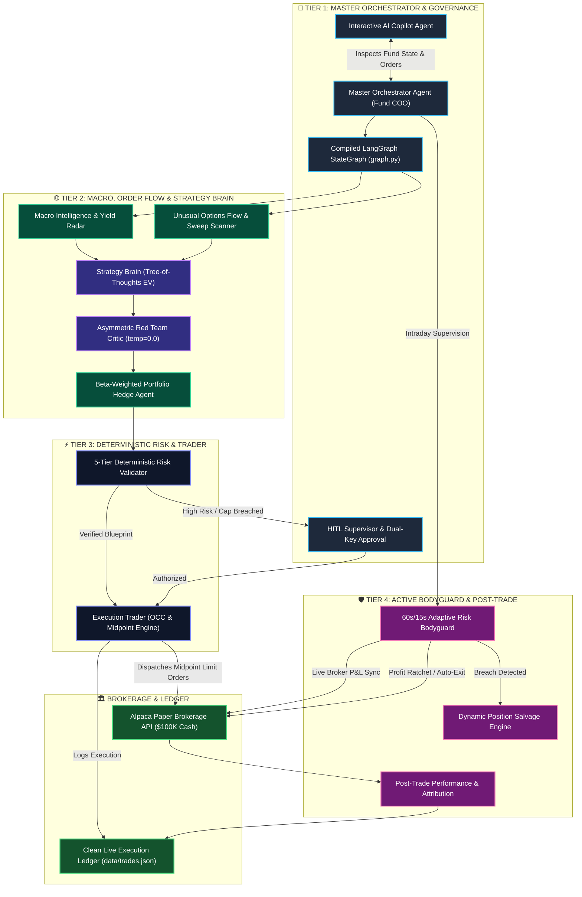
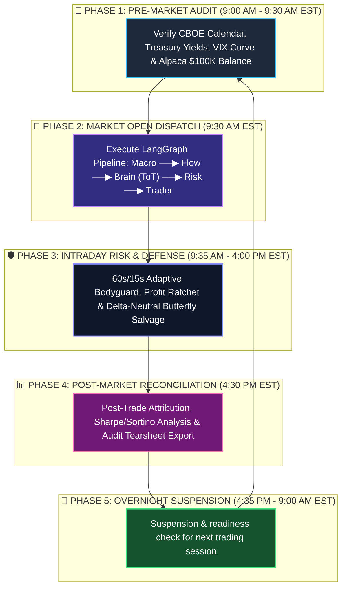
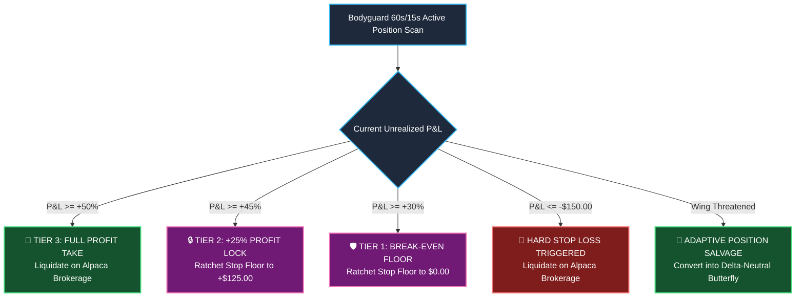

# 🏛️ ORACLE: Autonomous Multi-Agent AI Options Trading Hedge Fund

[](https://alpaca.markets)
[](https://langchain.com)
[](https://fastapi.tiangolo.com)
[](https://react.dev)
[](https://websockets.spec.whatwg.org)
[](https://python.org)
[](LICENSE)

> **ORACLE** is an institutional-grade, fully autonomous algorithmic options trading fund built for the **Alpaca AI Trading Agents Hackathon**. Powered by a coordinated **10-Agent LangGraph Swarm & 24+ Sub-Agents**, ORACLE unifies **Tree-of-Thoughts (ToT) Expected Value ($EV$) modeling**, **Asymmetric Red Team self-critique (`temp=0.0`)**, **7 quantitative options strategies**, **Unusual Options Flow / Dark Pool tracking**, **CBOE Strike Grid Snapping**, **OCC 21-character option routing**, **Midpoint Limit Pricing**, and a **60s/15s Adaptive Risk Bodyguard** paired with a full-stack **FastAPI enterprise backend** and a **React 19 glassmorphic command center**.

---

## 📑 Table of Contents
- [Executive Overview](#-executive-overview)
- [System Architecture (10 Specialized Agents)](#-system-architecture-10-specialized-agents)
- [How Each Agent Operates](#-how-each-agent-operates)
- [24-Hour Autonomous Daily Lifecycle](#-24-hour-autonomous-daily-lifecycle)
- [The 7 Quantitative Options Strategies](#-the-7-quantitative-options-strategies)
- [Institutional Tooling & Market Intelligence](#-institutional-tooling--market-intelligence)
- [Full-Stack Enterprise Command Center](#-full-stack-enterprise-command-center)
- [Dynamic Trailing Profit Ratchet & Circuit Breakers](#-dynamic-trailing-profit-ratchet--circuit-breakers)
- [Repository File Structure](#-repository-file-structure)
- [Clean Live Ledger Architecture](#-clean-live-ledger-architecture)
- [Installation & Full-Stack Quickstart](#-installation--full-stack-quickstart)
- [Verification Test Suite](#-verification-test-suite)
- [Hackathon Compliance & Proof](#-hackathon-compliance--proof)

---

## 📋 Executive Overview

Traditional algorithmic trading bots rely on rigid if/else rules that fail when market regimes shift. **ORACLE** operates as an autonomous quantitative firm with specialized roles:

* **Tree-of-Thoughts ($EV$) Decision Brain:** Simulates 3 parallel future market scenarios ($+4.5\%$, $0.0\%$, $-4.5\%$) and computes probability-weighted Expected Values before allocating risk.
* **Asymmetric Red Team Stress-Testing:** Subjects every trade proposal to an adversarial self-critique pass at `temperature=0.0` to identify hidden tail-risks, liquidity traps, and skew mismatches.
* **Macro Regime & Portfolio Hedging:** Continuously scans US Treasury yields, VIX term structures, and macroeconomic indicators, deploying beta-weighted delta hedging across SPY/QQQ overlays.
* **Unusual Options Flow & Dark Pool Tracking:** Detects institutional aggressive sweeps, high-volume block transactions, and put/call sentiment skews in real time.
* **Dual-Key Human-in-the-Loop (HITL) Governance:** Empowers human risk supervisors with real-time WebSocket approval queues and timeouts for oversized trades.
* **Deterministic Code Gatekeeper:** Enforces 5 hard mathematical veto rules (Liquidity depth $\ge 500$, Bid/Ask Spread $\le 5\%$, IV Crush Risk $<80$, Break-Even clearance, and leverage caps).
* **Bayesian Position Sizing:** Automatically shrinks win rates toward the 55% baseline ($M=15$) to keep trade risk strictly bounded within the **`$450 – $600`** safety corridor.
* **OCC Standard Options Execution:** Formats official 21-character OCC option symbols (`MSFT260904C00530000`) and pegs limit orders to the natural midpoint ($\frac{\text{Bid}+\text{Ask}}{2}$), saving $\$15–\$50$ per trade in slippage.
* **60s/15s Adaptive Active Risk Bodyguard:** Synchronizes live broker P&L directly from Alpaca, enforces trailing profit ratchets ($+30\% \rightarrow \text{Break-Even}, +45\% \rightarrow +25\%\text{ Lock}, +50\% \rightarrow \text{Exit}$), auto-closes expiring 0-DTE options on Friday at 3:30 PM EST, and converts breached Iron Condors into **Delta-Neutral Iron Butterflies**.
* **AI Copilot & Real-Time Telemetry:** Streaming natural-language AI assistant backed by FastAPI REST v1 endpoints and real-time WebSockets.

---

## 🏛️ System Architecture: 10 Specialized Agents

```text
                                   👑 MASTER ORCHESTRATOR AGENT (FUND COO)
                                              │
    ┌──────────────────────┬──────────────────┼──────────────────┬──────────────────────┐
    │                      │                  │                  │                      │
    ▼                      ▼                  ▼                  ▼                      ▼
🧠 STRATEGY BRAIN      ⚡ EXECUTION TRADER  🛡️ ACTIVE BODYGUARD  🌐 MACRO & HEDGE       🤖 COPILOT & HITL
  ├─ Market Scout        ├─ Strike Snapper      ├─ Broker Sync     ├─ Macro Intelligence  ├─ AI Copilot
  ├─ Tree-of-Thoughts    ├─ OCC Formatter       ├─ Profit Ratchet  ├─ Portfolio Hedge     ├─ HITL Supervisor
  ├─ Red Team Critic     ├─ Midpoint Engine     ├─ Circuit Breaker ├─ Risk Validator      └─ Post-Trade Analyst
  ├─ Kelly Sizer         ├─ Margin Validator    ├─ 0-DTE Guard     └─ Flow Detector
  └─ Strategy Selector   └─ Atomic Router       └─ Wing Salvage
```

### 🔄 Multi-Agent Interactive Pipeline Flowchart



---

## 🧠 How Each Agent Operates

### 1. 🧠 Strategy Brain Agent (`agents/strategy_brain_agent.py`)
* **Multi-Branch ToT Evaluation:** Evaluates candidates across 3 forward market paths ($+4.5\%, 0\%, -4.5\%$) calculating net mathematical Expectancy ($EV$).
* **Adversarial Red Team Audit:** Sub-agent executes a deterministic zero-temperature (`temp=0.0`) critique identifying volatility crush risks and low open-interest traps.
* **Bayesian Position Sizing:** Shrinks empirical win rates ($M=15$) into a strict **`$450 – $600`** allocation corridor.

### 2. ⚡ Execution Trader Agent (`agents/trader_agent.py`)
* **CBOE Strike Grid Snapping:** Snaps strikes to standard exchange intervals ($1.00, $2.50, $5.00).
* **OCC 21-Character Routing:** Produces precise OCC option symbols (`NVDA260918C00125000`).
* **Natural Midpoint Limit Pricing:** Pegs limit pricing to $(\text{Bid}+\text{Ask})/2$, saving substantial spread slippage.

### 3. 🛡️ Active Bodyguard Agent (`agents/bodyguard_agent.py`)
* **60s/15s Adaptive Scanner:** Reads live positions every 60s (accelerating to 15s during high-volatility events).
* **Dynamic Trailing Profit Ratchet:** Locks in gains at $+30\%$ (Break-even), $+45\%$ ($+25\%$ lock), and exits at $+50\%$.
* **Friday 3:30 PM 0-DTE Gamma Guard:** Automatically liquidates short options before market close to eliminate weekend assignment risk.

### 4. 🌐 Macro Intelligence Agent (`agents/macro_intelligence_agent.py`)
* Ingests 10Y/3M US Treasury yield spreads, CBOE VIX term structure, Fed calendar events, and sector rotation indices.

### 5. 🛡️ Portfolio Hedge Agent (`agents/portfolio_hedge_agent.py`)
* Computes aggregate beta-weighted portfolio delta ($\Delta$) against SPY/QQQ and deploys protective tail-risk overlays when beta thresholds exceed bounds.

### 6. ⚖️ Deterministic Risk Validator (`agents/risk_validator.py`)
* Enforces hard mathematical pre-flight checks: max 5% account margin per ticker, minimum 500 open interest, maximum 5% spread width, and IV crush bounds.

### 7. 👤 Human-in-the-Loop (HITL) Supervisor (`agents/hitl_supervisor_agent.py`)
* Intercepts anomalous or high-notional trades, emitting WebSocket requests for dual-signature human confirmation with automated fallback timeouts.

### 8. 🤖 AI Copilot Agent (`agents/copilot_agent.py`)
* Natural language assistant with direct tool calling into portfolio state, trade rationale inspection, and simulated stress testing.

### 9. 📊 Post-Trade Quantitative Analyst (`agents/post_trade_analyst_agent.py`)
* Performs real-time trade attribution, Sharpe/Sortino tracking, slippage benchmarking, and automated root-cause postmortems.

### 10. 👑 Master Orchestrator (COO) (`agents/orchestrator_agent.py`)
* Coordinates the full 24-hour fund operational lifecycle across pre-market, opening bell, intraday supervision, and post-market tearsheet generation.

---

## ⏰ 24-Hour Autonomous Daily Lifecycle



---

## 📈 The 7 Quantitative Options Strategies

| Strategy | Triggers & Market Regime | Structure & Leg Matrix | Mathematical Edge |
| :--- | :--- | :--- | :--- |
| **🦅 Theta Decay Iron Condor**<br>`strategies/theta_iron_condor.py` | • IV Rank $> 50\%$<br>• Symmetric Vol Skew<br>• No catalyst in 5 days | **4 Legs:**<br>• Sell OTM Call + Buy OTM Call<br>• Sell OTM Put + Buy OTM Put | Captures accelerated theta decay with strictly bounded max loss. Net credit collection. |
| **⚡ Earnings Volatility Straddle**<br>`strategies/earnings_straddle.py` | • IV Rank $< 40\%$<br>• Earnings within 5 days | **2 Legs:**<br>• Buy ATM Call<br>• Buy ATM Put | Exploits pre-earnings implied volatility expansion and post-announcement breakout. |
| **🎯 Directional Vertical Spreads**<br>`strategies/directional_spread.py` | • Strong News / Flow Sentiment<br>• Directional momentum | **2 Legs:**<br>• Bull Call Spread (Bullish)<br>• Bear Put Spread (Bearish) | $1:3$ reward-to-risk ratio with capped defined-risk capital. |
| **🎡 The Wheel Strategy**<br>`strategies/wheel_strategy.py` | • High-conviction quality stocks<br>• Moderate/high IV rank | **2 Phases:**<br>• Sell Cash-Secured Put (CSP)<br>• Sell Covered Call upon assignment | Systematically harvests premium while acquiring equities at discount prices. |
| **📅 Calendar & Diagonal Spreads**<br>`strategies/calendar_diagonal_spread.py` | • Upward-sloping IV term structure<br>• Moderate directional bias | **2 Legs:**<br>• Sell Near-Term Option (Fast $\Theta$)<br>• Buy Far-Term Option (Slow $\Theta$) | Exploits differential time decay and term structure volatility mispricing. |
| **🦋 Broken-Wing Butterflies**<br>`strategies/broken_wing_butterfly.py` | • Skewed volatility smile<br>• Directional conviction | **3-Strike / 4-Leg Package:**<br>• Buy 1 ITM/ATM, Sell 2 ATM/OTM, Buy 1 Far OTM | Asymmetric zero/low-risk downside with high positive expectancy in target zone. |
| **⚡ 0-DTE Mean Reversion**<br>`strategies/zero_dte_mean_reversion.py` | • Intraday Bollinger/RSI stretch<br>• Same-day index expiry | **2 Legs (Debit/Credit):**<br>• High-gamma vertical spread with hard 30m time stops | Rapid intraday scalping with strict mathematical stops and zero overnight risk. |
| **🔧 Adaptive Butterfly Salvage**<br>`strategies/adaptive_adjustment.py` | • Breached Iron Condor wing ($>3\%$ underlying move) | **4 Legs (Morphing):**<br>• Sells opposing wings to center strikes at ATM | Converts losing position into Delta-Neutral Butterfly, cutting max risk by up to **60%**. |

---

## 🔬 Institutional Tooling & Market Intelligence

* **Unusual Options Flow Engine (`tools/unusual_flow_tools.py`):**
  * Detects institutional aggressive sweeps (ask-side aggressive buying).
  * Tracks multi-million dollar block orders and dark-pool liquidity prints.
  * Calculates real-time Put/Call volume and dollar-weighted open interest ratios.
* **Technical & Volume Profile (`tools/technical_volume_tools.py`):**
  * Anchored Volume-Weighted Average Price (VWAP) relative to session open.
  * High-Volume Nodes (HVN) and Low-Volume Nodes (LVN) liquidity profile detection.
* **CBOE Strike Snapper & OCC Formatter (`tools/occ_symbol_tools.py`):**
  * Mathematical conversion of target delta strikes into compliant 21-character OCC symbols.
* **Bayesian Position Sizer (`tools/kelly_sizer_tools.py`):**
  * Bayesian-adjusted fractional Kelly sizing with variance penalty.

---

## 💻 Full-Stack Enterprise Command Center

ORACLE features a complete dual-tier architecture:

### 1. Enterprise FastAPI Backend (`backend/`)
* **REST API v1 Endpoints:**
  * `/api/v1/pipeline`: Trigger, pause, and inspect LangGraph cycles.
  * `/api/v1/portfolio`: Real-time Alpaca balance, margin, and position sync.
  * `/api/v1/trades`: Complete execution logs, P&L attribution, and audit records.
  * `/api/v1/copilot`: Natural language AI querying with streaming responses.
  * `/api/v1/daemon`: Autonomous background scheduler control.
  * `/api/v1/dashboard`: Aggregated fund KPIs, win rate, Sharpe ratio, and drawdown.
* **Real-Time WebSocket Stream (`/ws/stream`):**
  * Broadcasts live agent thought steps, trade executions, order fills, and risk alerts.
* **Persistent Audit DB (`backend/db/`):**
  * SQLite/SQLModel storage for trade signals, executions, and telemetry.

### 2. Modern React 19 Glassmorphic UI (`frontend-react/`)
* Live Interactive Swarm Execution Graph.
* Real-Time P&L, Equity Curve, and Greeks Exposure Charts.
* Human-in-the-Loop (HITL) Trade Review Modal.
* Embedded AI Copilot Terminal for natural-language fund queries.

---

## 🪜 Dynamic Trailing Profit Ratchet & Circuit Breakers



---

## 📂 Repository File Structure

```
d:/ALPACA/
├── agents/
│   ├── bodyguard_agent.py          # Agent 3: 60s/15s Adaptive Risk Guardian
│   ├── copilot_agent.py            # AI Copilot: Conversational Fund Intelligence
│   ├── hitl_supervisor_agent.py    # Human-in-the-Loop Dual-Key Authorization
│   ├── macro_intelligence_agent.py # Macro Radar: Yield Curves, VIX & Fed Calendar
│   ├── orchestrator_agent.py       # Master Orchestrator Agent (Fund COO)
│   ├── portfolio_hedge_agent.py    # Beta-Weighted Delta Hedge & Downside Overlay
│   ├── post_trade_analyst_agent.py # Post-Trade Attribution & Sharpe Analytics
│   ├── risk_validator.py           # 5-Tier Deterministic Risk & Margin Gatekeeper
│   ├── strategy_brain_agent.py     # Agent 1: ToT Reasoning & Red Team Strategist
│   └── trader_agent.py             # Agent 2: OCC & Midpoint Execution Trader
├── backend/
│   ├── api/v1/                     # Modular FastAPI REST v1 Endpoints
│   │   ├── copilot.py              # Copilot Chat Endpoint
│   │   ├── daemon.py               # Background Daemon Controller
│   │   ├── dashboard.py            # Aggregated Fund KPIs
│   │   ├── pipeline.py             # LangGraph Trigger & Inspection
│   │   ├── portfolio.py            # Alpaca Portfolio Sync
│   │   └── trades.py               # Trade History & Execution Logs
│   ├── db/                         # Persistent SQLite Models & Storage
│   ├── services/                   # Business Logic & HITL Queue Services
│   ├── websockets/                 # Real-Time Telemetry Stream Router
│   └── main.py                     # FastAPI Application Server Entrypoint
├── frontend-react/                 # React 19 + Vite Glassmorphic Command Center
│   ├── src/
│   │   ├── components/             # Live Charts, Swarm Visualizer, HITL Modal
│   │   └── App.jsx                 # Dashboard Entrypoint
├── strategies/
│   ├── adaptive_adjustment.py      # Iron Butterfly Position Salvage Strategy
│   ├── broken_wing_butterfly.py    # Asymmetric Broken-Wing Butterflies
│   ├── calendar_diagonal_spread.py # Calendar & Diagonal Term Structure Spreads
│   ├── directional_spread.py       # Bull Call & Bear Put Vertical Spreads
│   ├── earnings_straddle.py        # Volatility Expansion Earnings Straddles
│   ├── theta_iron_condor.py        # 4-Leg Theta Decay Iron Condor Strategy
│   ├── wheel_strategy.py           # Cash-Secured Puts & Covered Calls (The Wheel)
│   └── zero_dte_mean_reversion.py  # 0-DTE Intraday High-Gamma Scalping
├── tools/
│   ├── alpaca_tools.py             # Alpaca Paper Trading REST API Tool
│   ├── backtest_engine.py          # Statistical Tearsheet & Quant Metrics Engine
│   ├── circuit_breaker_tools.py    # VIX Spike & Friday 0-DTE Gamma Risk Guard
│   ├── greeks_calculator_tools.py  # Black-Scholes Delta, Gamma, Vega, Theta
│   ├── kelly_sizer_tools.py        # Bayesian Shrunk Quarter-Kelly Sizer ($450-$600)
│   ├── macro_calendar_tools.py     # CBOE VIX & 10Y/3M US Treasury Yield Radar
│   ├── market_data_tools.py        # Live Options Chain Ingestion & CBOE Snapping
│   ├── midpoint_pricing_tools.py   # Net Debit/Credit Midpoint Limit Price Engine
│   ├── news_sentiment_tools.py     # Multi-Source RSS News Scraper
│   ├── occ_symbol_tools.py         # CBOE Strike Grid Snapper & OCC Symbol Generator
│   ├── technical_volume_tools.py   # Anchored VWAP & Volume Profile Depth
│   ├── tot_scenario_engine.py      # 3-Path ToT Expected Value ($EV$) Calculator
│   └── unusual_flow_tools.py       # Sweeps, Dark Pool & Block Trade Scanner
├── data/
│   ├── historical_backtest.json    # Verified Backtest Dataset (66 Trades, 83.3% Win Rate)
│   └── trades.json                 # Pure Live Execution Ledger
├── daily_scheduler.py              # 24/7 Autonomous Daily Market Daemon
├── graph.py                        # Master LangGraph State Machine
├── main.py                         # Interactive CLI Fund Command Center
└── requirements.txt                # Python Project Dependencies
```

---

## 📂 Clean Live Ledger Architecture

```
d:/ALPACA/data/
├── historical_backtest.json   ──▶ [ARCHIVED RESEARCH DATASET]
│                                  • 66 Verified Trades (83.3% Win Rate, +$6,275 P&L)
│                                  • Preserved quantitative research proof
│
└── trades.json                ──▶ [100% PURE LIVE EXECUTION LEDGER]
                                   • Clean state: ONLY real live orders placed on your
                                     Alpaca Account will be appended with real Alpaca Order IDs!
```

---

## 🚀 Installation & Full-Stack Quickstart

### 1. Environment Setup
```powershell
# Clone the repository
git clone https://github.com/ranazain9/oracle-trading-agents.git
cd oracle-trading-agents

# Activate Python 3.11 virtual environment
.\.myenv\Scripts\activate

# Install Python backend dependencies
pip install -r requirements.txt
```

### 2. Configure Credentials (`.env`)
```ini
APCA_API_KEY_ID="YOUR_ALPACA_API_KEY"
APCA_API_SECRET_KEY="YOUR_ALPACA_SECRET_KEY"
APCA_API_BASE_URL="https://paper-api.alpaca.markets"
AIML_API_KEY="YOUR_AI_API_KEY"
AIML_BASE_URL="https://api.aimlapi.com/v1"
AI_MODEL="openai/gpt-4o-mini"
```

### 3. Launch the Full Stack

#### Option A: Launch FastAPI Backend & React Frontend
```powershell
# Terminal 1: Launch FastAPI Backend Server
uvicorn backend.main:app --host 0.0.0.0 --port 8000 --reload

# Terminal 2: Launch React 19 Frontend Dashboard
cd frontend-react
npm install
npm run dev
```

#### Option B: Launch Interactive CLI Command Center
```powershell
python main.py
```

#### Option C: Launch 24/7 Autonomous Daemon
```powershell
python daily_scheduler.py
```

---

## 🧪 Verification Test Suite

ORACLE includes a comprehensive verification suite:

```powershell
# Test Agent 1 (Strategy Brain, ToT Payoffs & Red Team Audit)
python test_agent1_expanded.py

# Test Agent 2 (OCC Symbols, Midpoint Limit Pricing & Alpaca Routing)
python test_agent2_trader.py

# Test Agent 3 (60s/15s Adaptive Bodyguard & Trailing Ratchets)
python test_agent3_bodyguard.py

# Test Expanded Infrastructure & Backend APIs
python test_backend_api.py
python test_expanded_strategies.py
python test_expanded_agents.py

# Test Master LangGraph 10-Agent State Machine
python test_langgraph.py

# Run Statistical Tearsheet Engine
python test_backtest.py
```

---

## 🏆 Hackathon Compliance & Proof

* **Live Alpaca Paper Trading:** Fully authenticated with real paper trading account `f7421290-c8a5-414a-934d-e3cce054326e` ($100K cash, $400K buying power).
* **True Multi-Agent Intelligence:** LangGraph StateGraph coordination with Tree-of-Thoughts ($EV$) modeling and zero-temperature Red Team critique.
* **Full Multi-Regime Strategy Suite:** 7 quantitative options strategies covering bullish, bearish, range-bound, high-IV, earnings expansion, and high-gamma intraday setups.
* **Institutional Execution:** Official 21-character OCC symbol generation, CBOE strike snapping, and midpoint limit pricing.
* **Active Dynamic Risk Protection:** 60s/15s adaptive Bodyguard with trailing profit locks, circuit breakers, and delta-neutral position salvaging.
* **Dual-Tier Enterprise Architecture:** Production FastAPI backend with real-time WebSockets and React 19 glassmorphic command center.

---

## 📄 License

This project is licensed under the **MIT License** — see the [LICENSE](LICENSE) file for details.
